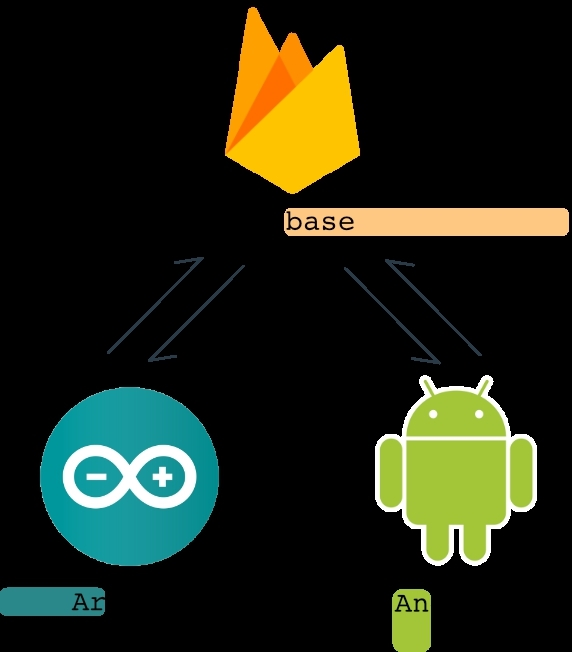
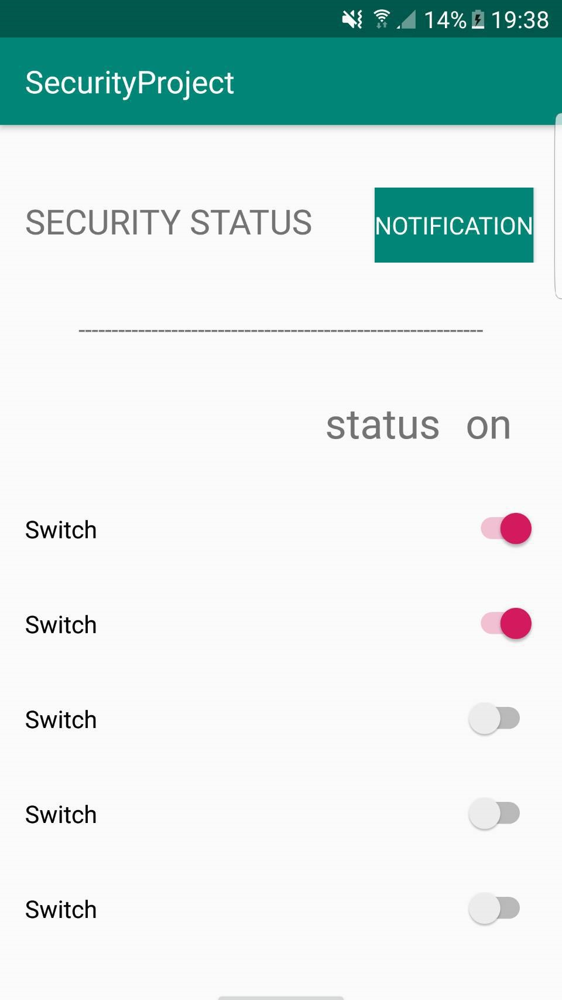

<br><br>
[](http://www.it.kmitl.ac.th)
<br><br>

# il est prudent n safe
  ในปัจจุบันมีคดีอาชญากรรม โจรกรรม ลักขโมยทรัพย์สินในบ้านเรือนเกิดขึ้นบ่อยครั้ง จึงมีแนวคิดที่จะทำระบบในการตรวจสอบการบุกรุกเข้ามาในสถานที่ และระงับเหตุการณ์ที่สามารถเกิดขึ้นได้ ความปลอดภัยในระบบการทำงานด้านต่างๆเช่น ด้านการเกษตร ด้านการผลิตในแต่ละอุตสาหกรรม ด้านการแพทย์ โดยใช้เทคโนโลยี ไมโทรคอนโทรเลอร์ (Micro-controller) ซึ่งถูกนำมาใช้อย่างกว้างขวางในงานอุตสาหกรรม เพื่อควบคุมเครื่องจักรและระบบการผลิตต่างๆ โดยวัถุประสงค์ของการใช้ไมโทรคอนโทรเลอร์หลักๆนั้น ใช้ในการควบคุม เพราะมีความรวมเร็ว ถูกต้องและแม่นยำ นำมาประยุกต์ให้เกิดระบบแจ้งสัญญาณขโมยและส่งสัญญาณอัคคีภัยให้กับผู้ใช้งาน ซึ่งใช้อินฟาเหรดในการตรวจจับการเคลื่อนไหวรวมทั้งเซนเซอร์ตรวจจับแจ้งเตือนทั้งระบบเสียง และส่งสัญญาณจาก Firebase เพื่อแจ้งเตือนไปที่โทรศัพท์ของผู้ใช้งาน
  
 ## Diagram
 
 
 ## Result Technology
 
 


- This is a project for computer programming 06016315
- โปรเจคนี้เป็นส่วนหนึ่งของรายวิชา คอมพิมเตอร์โปรแกรมมิ่ง 06016315


# ☀ Member

&nbsp;&nbsp;&nbsp;&nbsp;&nbsp;&nbsp;&nbsp;&nbsp;&nbsp;&nbsp;&nbsp;&nbsp;&nbsp;&nbsp;&nbsp;&nbsp;&nbsp;&nbsp;&nbsp;&nbsp;&nbsp;&nbsp;&nbsp;&nbsp;<a href=""></a> &nbsp;&nbsp;&nbsp;&nbsp;&nbsp;&nbsp;&nbsp;&nbsp;&nbsp;&nbsp;&nbsp;&nbsp;&nbsp;&nbsp;&nbsp;&nbsp;<a href=""></a> &nbsp;&nbsp;&nbsp;&nbsp;&nbsp;&nbsp;&nbsp;&nbsp;&nbsp;&nbsp;&nbsp;&nbsp;&nbsp;&nbsp;&nbsp;&nbsp;<a href=""></a> &nbsp;&nbsp;&nbsp;&nbsp;&nbsp;&nbsp;&nbsp;&nbsp;&nbsp;&nbsp;&nbsp;&nbsp;&nbsp;&nbsp;&nbsp;&nbsp;<a href=""></a>


&nbsp;&nbsp;&nbsp;&nbsp;&nbsp;&nbsp;&nbsp;&nbsp;&nbsp;&nbsp;&nbsp;&nbsp;&nbsp;&nbsp;&nbsp;&nbsp;&nbsp;&nbsp;&nbsp;&nbsp;&nbsp;&nbsp;&nbsp;&nbsp;&nbsp;&nbsp;&nbsp;&nbsp;61070043 &nbsp;&nbsp;&nbsp;&nbsp;&nbsp;&nbsp;&nbsp;&nbsp;&nbsp;&nbsp;&nbsp;&nbsp;&nbsp;&nbsp;&nbsp;&nbsp;&nbsp;&nbsp;&nbsp;&nbsp;&nbsp;&nbsp;&nbsp;61070058 &nbsp;&nbsp;&nbsp;&nbsp;&nbsp;&nbsp;&nbsp;&nbsp;&nbsp;&nbsp;&nbsp;&nbsp;&nbsp;&nbsp;&nbsp;&nbsp;&nbsp;&nbsp;&nbsp;&nbsp;&nbsp;&nbsp;&nbsp;61070091  &nbsp;&nbsp;&nbsp;&nbsp;&nbsp;&nbsp;&nbsp;&nbsp;&nbsp;&nbsp;&nbsp;&nbsp;&nbsp;&nbsp;&nbsp;&nbsp;&nbsp;&nbsp;&nbsp;&nbsp;&nbsp;&nbsp;&nbsp;61070121

&nbsp;&nbsp;&nbsp;&nbsp;&nbsp;&nbsp;&nbsp;&nbsp;&nbsp;&nbsp;&nbsp;&nbsp;&nbsp;&nbsp;&nbsp;&nbsp;&nbsp;&nbsp;&nbsp;&nbsp;&nbsp;&nbsp;&nbsp;&nbsp;&nbsp;&nbsp;ฐานิด สำเนียง&nbsp;&nbsp;&nbsp;&nbsp;&nbsp;&nbsp;&nbsp;&nbsp;&nbsp;&nbsp;&nbsp;ณิชยาพรรณ กรรภิรมย์พชิรา&nbsp;&nbsp;&nbsp;&nbsp;&nbsp;&nbsp;ธีรพล จิรชาญชัย&nbsp;&nbsp;&nbsp;&nbsp;&nbsp;&nbsp;&nbsp;&nbsp;&nbsp;&nbsp;&nbsp;&nbsp;&nbsp;&nbsp;ปารเมศ คงเจริญ


&nbsp;&nbsp;&nbsp;&nbsp;&nbsp;&nbsp;&nbsp;&nbsp;&nbsp;&nbsp;&nbsp;&nbsp;&nbsp;&nbsp;&nbsp;&nbsp;&nbsp;&nbsp;&nbsp;&nbsp;&nbsp;&nbsp;&nbsp;&nbsp;&nbsp;&nbsp;&nbsp;&nbsp;&nbsp;&nbsp; []&nbsp;&nbsp;&nbsp;&nbsp;&nbsp;&nbsp;&nbsp;&nbsp;&nbsp;&nbsp;&nbsp;&nbsp;&nbsp;&nbsp;&nbsp;&nbsp;&nbsp;&nbsp;&nbsp;&nbsp;&nbsp;&nbsp;&nbsp;&nbsp;&nbsp;&nbsp;&nbsp;&nbsp;&nbsp;&nbsp;&nbsp;&nbsp;&nbsp;&nbsp;&nbsp;&nbsp;[]&nbsp;&nbsp;&nbsp;&nbsp;&nbsp;&nbsp;&nbsp;&nbsp;&nbsp;&nbsp;&nbsp;&nbsp;&nbsp;&nbsp;&nbsp;&nbsp;&nbsp;&nbsp;&nbsp;&nbsp;&nbsp;&nbsp;&nbsp;&nbsp;&nbsp;&nbsp;&nbsp;&nbsp;[]&nbsp;&nbsp;&nbsp;&nbsp;&nbsp;&nbsp;&nbsp;&nbsp;&nbsp;&nbsp;&nbsp;&nbsp;&nbsp;&nbsp;&nbsp;&nbsp;&nbsp;&nbsp;&nbsp;&nbsp;&nbsp;&nbsp;&nbsp;&nbsp;&nbsp;&nbsp;&nbsp;&nbsp;&nbsp;&nbsp;&nbsp;&nbsp;[]


```sh
# Faculty of Information Technology
# คณะเทคโนโลยีสารสนเทศ

# King Mongkut's Institu of Technology Ladkrabang
# สถาบันเทคโนโลยยีพระจอมเกล้าเจ้าคุณทหารลาดกระบัง
```
